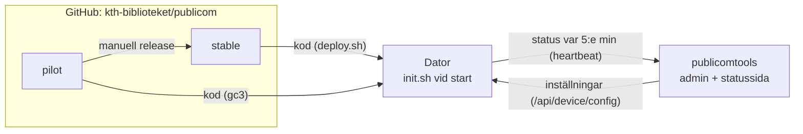

# PubLiCom

KTH Bibliotekets publika datorer: sökdatorer, gästdatorer med inloggning, grupprumsdatorer och skyltar.
Datorerna kör Ubuntu Server 24.04 med en låst gästsession (X, Openbox och Chromium i kioskläge).

Det här repot innehåller **koden** som körs på datorerna. **Inställningarna** och statusen hanteras i
[publicomtools](https://github.com/kth-biblioteket/publicomtools) (`https://apps.lib.kth.se/publicomtools`),
och **hemligheterna** ligger bara på varje dator.

| Del | Var | Hur den når datorn |
|---|---|---|
| Kod: skript, Chromium-grundpolicyer, skärmsläckarbilder | Det här repot | `deploy.sh` hämtar datorns gren från GitHub vid varje start |
| Inställningar: profil, webbplatser, skärmsläckare … | publicomtools (admin) | `init.sh` hämtar dem vid varje start, med datorns token |
| Hemligheter: tokens, lösenord | `/usr/local/bin/secrets/.secrets` | Läggs dit vid installation, lämnar aldrig datorn |



## Dokumentation

- **[Installera en dator](docs/installera.md)**: ny dator eller ominstallation på Ubuntu 24.04, BIOS, `.secrets`.
- **[Drift](docs/drift.md)**: vad som händer vid start, var inställningarna kommer ifrån, uppdateringar, felsökning.
- **[Utveckling och release](docs/utveckling.md)**: grenarna, release till `stable`, ny inställning, kontroller.
- **[Säkerhet](docs/sakerhet.md)**: vad som skyddar datorerna och vad som måste göras för hand.
- **[Test på riktig dator](docs/hardvarutest.md)**: checklista innan en ny version rullas ut.
- [Config via publicomtools](docs/config-via-publicomtools.md): bakgrund och beslut kring flytten av inställningarna.

## Läget just nu

- **Ny flotta:** Ubuntu 24.04, inställningar från publicomtools, kod från `stable`. gc3 är pilot och kör `pilot`.
- **Gamla flottan:** de gamla datorerna kör Ubuntu 22 med kod och inställningar från `main` på GitHub
  (`.config_*` i roten). De flyttas inte över, utan **installeras om** en och en enligt
  [Installera en dator](docs/installera.md). Tills den sista är ominstallerad får **`main` inte ändras**.
- När alla är ominstallerade tas `.config_*`, `config/base.env`, `config/profiles/`, `config/hosts/` och
  `tools/build-configs.sh` bort, och `main` blir utvecklingsgren igen.

## Struktur i repot

```
install.sh                 Installerar paket och engångsinställningar, kör sedan deploy.sh
files.manifest             Alla filer som installeras på datorerna, med rättigheter och ägare
files/                     Filerna, i samma sökväg som på datorn (files/usr/local/bin/init.sh -> /usr/local/bin/init.sh)
policies_*.json            Chromium-grundpolicyer (installeras med koden, väljs med inställningen POLICY_FILE)
screensaver/               Skärmsläckarbilder (installeras med koden, väljs med SCREENSAVER_FILES)
backgrounds/ icons/        Övriga bilder
config/catalog.json        Vilka inställningar datorerna förstår, läses in i publicomtools
tools/check.sh             Kontroller, körs av CI
docs/                      Dokumentationen

Bara för den gamla flottan (tas bort när den är ominstallerad):
config/base.env, config/profiles/, config/hosts/, .config_*, tools/build-configs.sh
```
